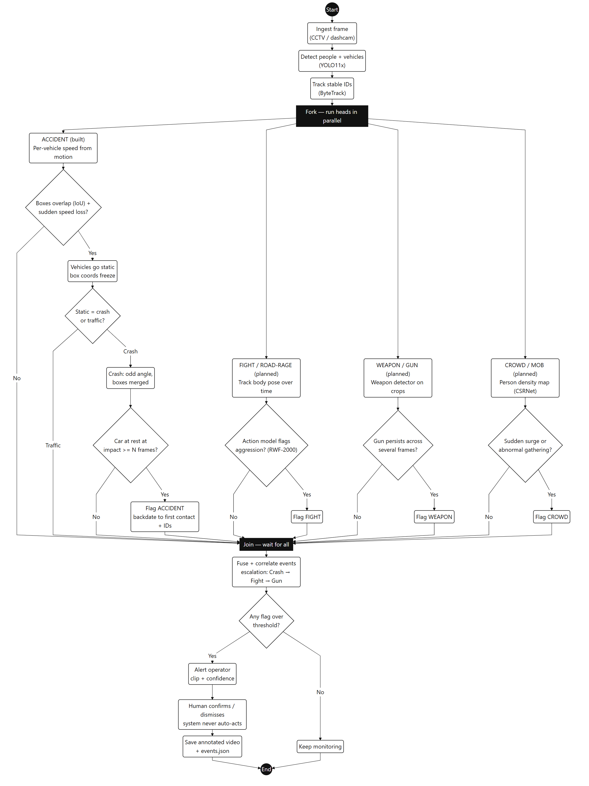

# Cars-Accident — Road Accident Detection from Video

Detect a road accident the **exact second it happens**, from raw CCTV or dashcam video. Every
vehicle is detected and tracked, the wreck is boxed in red, and the alert is **backdated to the
first frame of contact** instead of appearing seconds later in the aftermath.

It is an **assistive flag for a human operator**. It never calls anyone and never acts on its own.

## Demo


The crash is flagged at the first frame of contact and every vehicle in the pile-up is boxed in red.
Full-resolution annotated clips:
[clip 1](out/Car%20Accident%201.0_accident.mp4) ·
[clip 2](out/Car%20Accident%202_accident.mp4) ·
[clip 3](out/Car%20Accident%203_accident.mp4)

## System architecture



## How it works

A two-pass design, because a live single-pass detector cannot confirm a crash until the aftermath
(the cars must be seen to stop), which makes the alert appear late. On a recorded clip we do better:

1. **Pass 1 — detect + track.** `YOLO11x` detects every person and vehicle each frame; `ByteTrack`
   gives each a stable ID. Candidate impacts are recorded when two vehicle boxes overlap while at
   least one is violently shedding speed.
2. **Confirm.** Keep only candidates that actually became a wreck (an involved vehicle comes to rest
   and stays). This throws out passing-traffic overlaps and brake taps.
3. **Pass 2 — re-render from the impact frame,** so the red alert appears the instant it occurs and
   every vehicle in the pile-up gets its own box.

### Telling a real crash from a traffic jam

The hard part is not spotting stopped cars. In a jam the bounding boxes go static too. So a frozen
box only counts as a crash when the freeze **follows an impact and looks wrong** (odd angle, boxes
merged), not when traffic is simply lane-aligned and slowing down gradually.

## Usage

```bash
pip install -r requirements.txt
# ffmpeg must be on PATH; a CUDA GPU is recommended
python detect_accidents.py "path/to/video.mp4"
# or, with no argument, it runs the bundled clips
```

Each run writes an annotated `*_accident.mp4` and a machine-readable `*_events.json`
(timestamp of first contact, involved vehicle IDs, reason, cue score) to `out/`.

## Honest notes

- Detection is **pretrained** `YOLO11x` (COCO), not fine-tuned.
- The crash logic is **rule-based**; its thresholds are tuned to the test footage. The reported
  confidence is a **heuristic cue score in [0, 1], not an accuracy figure**. No numbers are faked.
- **Human-in-the-loop.** The system flags for review; a person confirms or dismisses.
- The fully general path is a **learned crash model** trained on data (CADP / DoTA / CCD). That is
  the next real investment, not more rule-tuning.

## Roadmap

The same detect + track backbone extends to **fight / road-rage**, **weapon**, and **crowd / mob**
detection heads, with an optional **LLM / VLM verification** stage that confirms an event and writes
a plain-language reason before a human sees it. See [`docs/system_architecture.md`](docs/system_architecture.md).

## Stack

Python, YOLO11x (Ultralytics), ByteTrack, OpenCV, PyTorch, ffmpeg.
