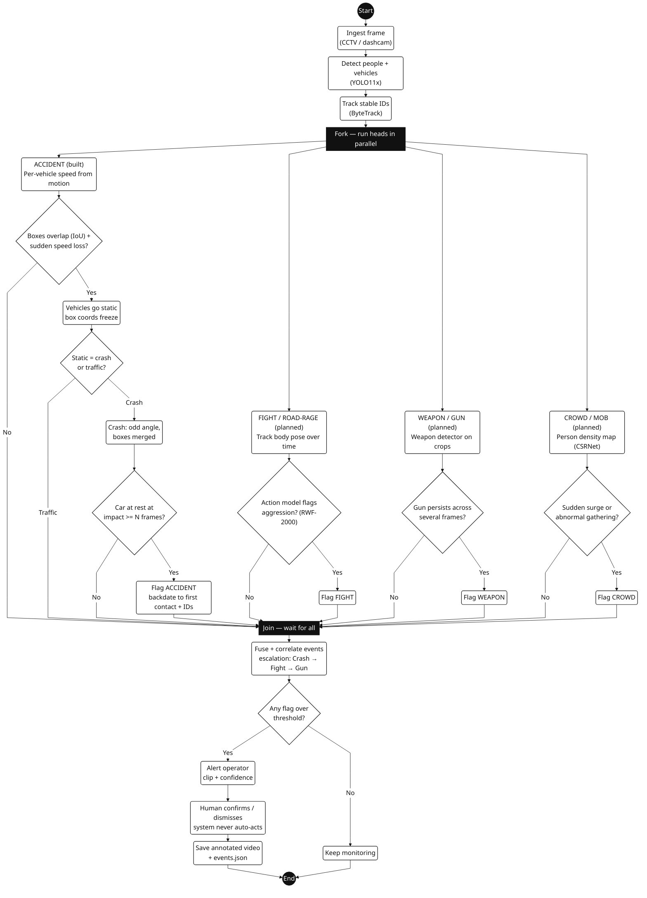

# Road Incident Detection System — UML Activity Diagram

Black-and-white UML activity diagram, portrait 3:4, laid out to fill the page.

> For infinite sharpness open `system_uml.svg` (vector, never blurs at any zoom).

## How to read it

The frame is processed **once** (detect + track), then a **fork** fans it out to four detection
heads that run **in parallel**. A **join** waits for all of them, candidate events are fused and
correlated, and only if a flag clears the threshold does a **human** confirm or dismiss. The
system never acts on its own.

### The accident head — how it avoids false alarms in traffic

- **Contact + shock** — two boxes overlap (IoU) and a moving vehicle suddenly loses most of its speed.
- **Static** — after impact the boxes go still. The catch: **a traffic jam also freezes the boxes.**
- **Disambiguate** — *crash* (odd angle, boxes merged, car stays at rest) vs *traffic*
  (lane-aligned, gradual → ignored).
- **Flag** — backdate to the **first frame of contact** and record the involved IDs.

## Build status

| Part | Status | Tech |
|---|---|---|
| Detect + track (shared backbone) | **Built** | YOLO11x (pretrained) + ByteTrack |
| Accident / collision | **Built** | IoU + shock + static-vs-traffic + rest-confirm, two-pass |
| Fight / road-rage | Planned | body pose over time + temporal action model (RWF-2000) |
| Weapon / gun | Planned | weapon detector fine-tuned + persist-across-frames |
| Crowd / mob | Planned | person density map (CSRNet) + surge |
| Fusion + human review | Partial / Planned | correlate escalation chain, operator confirms, never auto-acts |
| LLM / VLM verification | Planned (optional) | vision-language model confirms real events; slots between the threshold and the alert |

**The honest gate:** accidents work today (pretrained detection + tuned rules). The other heads are
*learned* models — they need labelled domain data to be trustworthy.

## Two design rules

- **One detect+track pass feeds every head.** Do not run four models per frame.
- **Human-in-the-loop, always.** Every output is an assistive flag with a confidence, never an action.

Diagram source (renders on GitHub / Notion / VS Code)

